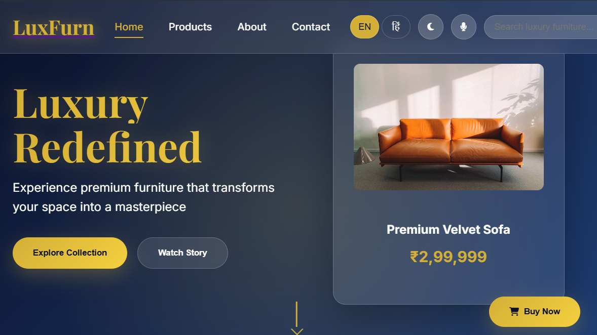

# LuxFurn - Luxury Furniture E-commerce Platform

## 📋 Internship Assignment

This project is part of an internship assignment to develop a comprehensive luxury furniture e-commerce platform. The assignment demonstrates full-stack development skills including frontend design, backend API development, database management, and modern web technologies.

## 🏗️ Project Overview

LuxFurn is a premium furniture e-commerce platform that offers a sophisticated shopping experience for luxury furniture. The project combines modern frontend technologies with a robust Laravel backend to create a seamless user experience.

### Key Features

- **Modern Responsive Design**: Beautiful, mobile-first design with dark/light theme support
- **Multi-language Support**: English and Hindi language options
- **Advanced Search**: Voice search and intelligent product suggestions
- **Shopping Cart**: Full cart functionality with session management
- **Product Management**: Comprehensive product catalog with categories
- **User Authentication**: Secure user registration and login system
- **Admin Panel**: Complete backend management system
- **Database Integration**: SQLite database with proper migrations and seeders

## 🛠️ Technology Stack

### Frontend
- **HTML5** - Semantic markup
- **CSS3** - Modern styling with animations and responsive design
- **JavaScript (ES6+)** - Interactive functionality and API integration
- **Vite** - Build tool and development server
- **Font Awesome** - Icon library
- **Google Fonts** - Typography (Inter & Playfair Display)

### Backend
- **Laravel 10** - PHP framework for backend development
- **SQLite** - Lightweight database
- **Eloquent ORM** - Database management
- **Blade Templates** - Server-side templating
- **RESTful APIs** - JSON API endpoints

## 📁 Project Structure

```
project/
├── 📄 index.html              # Main homepage
├── 📄 styles.css              # Main stylesheet
├── 📄 script.js               # Main JavaScript file
├── 📄 package.json            # Node.js dependencies
├── 📷 img1.png               # Project screenshot/demo image 1
├── 📷 img2.png               # Project screenshot/demo image 2
├── 📁 pages/                  # Additional HTML pages
│   ├── about.html
│   ├── cart.html
│   ├── contact.html
│   └── products.html
├── 📁 js/                     # JavaScript modules
│   ├── cart.js
│   ├── common.js
│   ├── contact.js
│   ├── home.js
│   └── products.js
├── 📁 luxury-furniture/       # Laravel backend
│   ├── app/
│   ├── database/
│   ├── resources/
│   ├── routes/
│   └── ...
└── 📄 laravel-backend-guide.md # Backend implementation guide
```

## 🚀 Getting Started

### Prerequisites
- Node.js (v16 or higher)
- PHP (v8.1 or higher)
- Composer
- Git

### Frontend Setup

1. **Clone the repository**
   ```bash
   git clone <repository-url>
   cd project
   ```

2. **Install dependencies**
   ```bash
   npm install
   ```

3. **Start development server**
   ```bash
   npm run dev
   ```

4. **Build for production**
   ```bash
   npm run build
   ```

### Backend Setup

1. **Navigate to Laravel directory**
   ```bash
   cd luxury-furniture
   ```

2. **Install PHP dependencies**
   ```bash
   composer install
   ```

3. **Set up environment**
   ```bash
   cp .env.example .env
   php artisan key:generate
   ```

4. **Run database migrations**
   ```bash
   php artisan migrate
   ```

5. **Seed the database**
   ```bash
   php artisan db:seed
   ```

6. **Start Laravel server**
   ```bash
   php artisan serve
   ```

## 🎨 Design Features

### Visual Elements
- **Modern UI/UX**: Clean, minimalist design with luxury aesthetics
- **Responsive Layout**: Optimized for all device sizes
- **Dark/Light Themes**: Toggle between themes for user preference
- **Smooth Animations**: CSS transitions and micro-interactions
- **Typography**: Professional font combinations

### User Experience
- **Intuitive Navigation**: Easy-to-use menu system
- **Product Showcase**: High-quality product images and descriptions
- **Shopping Cart**: Seamless cart management
- **Search Functionality**: Advanced search with voice support
- **Multi-language**: Bilingual support (English/Hindi)

## 📊 Database Schema

The project includes a comprehensive database structure with:
- **Users Table**: User authentication and profiles
- **Categories Table**: Product categorization
- **Products Table**: Product information and inventory
- **Orders Table**: Order management
- **Cart Table**: Shopping cart functionality

## 🔧 API Endpoints

The Laravel backend provides RESTful APIs for:
- Product management (CRUD operations)
- User authentication
- Shopping cart operations
- Order processing
- Search functionality

## 📸 Project Screenshots

The project includes two demonstration images showcasing the visual design and user interface of the LuxFurn platform:

### Main Homepage and Product Showcase


### Additional Features and Functionality


These screenshots demonstrate the modern, responsive design and comprehensive functionality of the luxury furniture e-commerce platform.

## 🎯 Learning Objectives

This internship assignment covers:
- **Frontend Development**: Modern HTML, CSS, and JavaScript
- **Backend Development**: Laravel framework and PHP
- **Database Design**: SQLite with proper relationships
- **API Development**: RESTful API design and implementation
- **Responsive Design**: Mobile-first approach
- **User Experience**: Intuitive navigation and interactions
- **Project Management**: Code organization and documentation

## 📝 Assignment Requirements

✅ **Frontend Development**
- Responsive design implementation
- Modern UI/UX principles
- Interactive JavaScript functionality
- Cross-browser compatibility

✅ **Backend Development**
- Laravel framework implementation
- Database design and migrations
- API endpoint development
- Authentication system

✅ **Database Management**
- Proper table relationships
- Data seeding
- Migration management

✅ **Documentation**
- Comprehensive README
- Code comments
- Implementation guides

## 🤝 Contributing

This is an internship assignment project. For questions or clarifications, please refer to the assignment guidelines or contact the supervising instructor.

## 📄 License

This project is created for educational purposes as part of an internship assignment.

---

**Developed as part of an internship assignment**  
*LuxFurn - Luxury Furniture E-commerce Platform* 